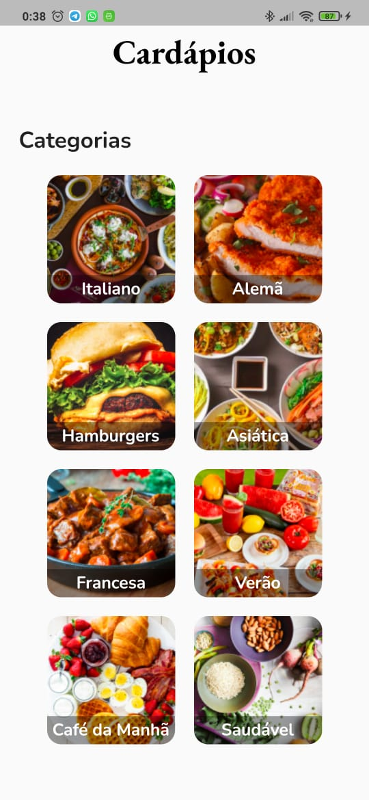
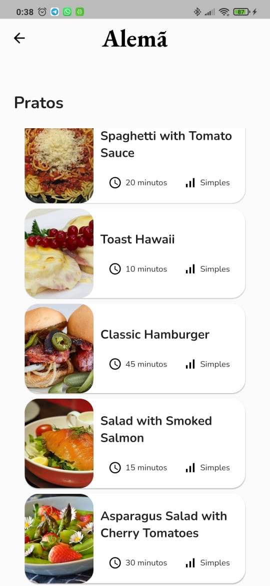
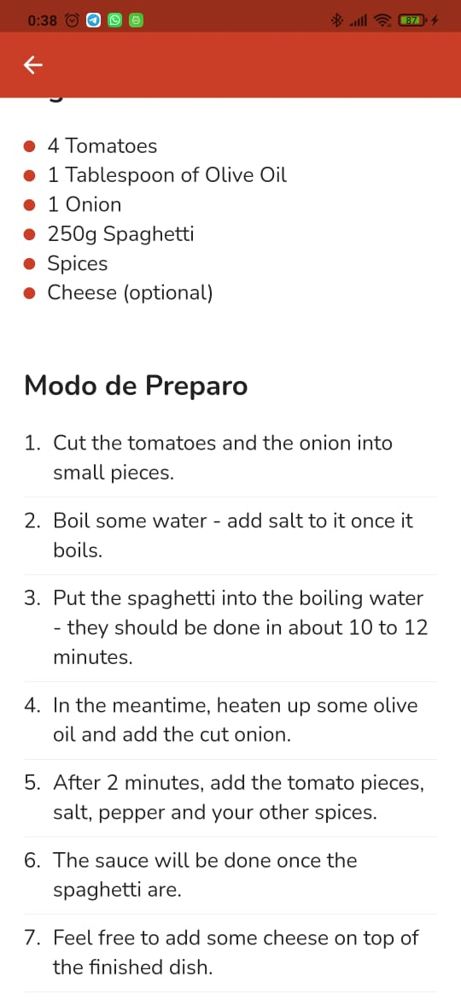

<h1 align="center">
     🍔 Meals Flutter
</h1>

<h3 align="center">
    App contendo receitas culinárias
</h3>

<p align="center">
  

  
  
  <a href="https://github.com/gabshs/meals-flutter/commits/main">
    
  </a>
    
   <a href="https://github.com/gabshs/meals-flutter/stargazers">
    
  </a>
</p>

<h4 align="center">
	🚧   Em desenvolvimento  🚧
</h4>

Tabela de conteúdos
=================

<p align="center">  <a href="#objetivo">Objetivo</a> • <a href="#layout">Layout</a> • <a href="#how-to">Como executar</a> • <a href="#tecnologias">Tecnologias</a>  • <a href="#autor">Autor</a>  </p>


## 💻 Objetivo

App desenvolvido para reforçar meus aprendizados sobre navegação em Flutter. Utilizei o projeto Meals do curso de Flutter da Cod3r como inspiraçao e refiz o layout utilizando o Figma. <a href="https://www.figma.com/file/zNdIIODeN7NJ1RzVRHWDS8/Meals-Flutter?node-id=0%3A1">Link do projeto no Figma</a>.

---


## 🎨 Layout

<p align="center">
  
    
    
    
</p>


---

## 🚀 Como executar o projeto


### Pré-requisitos

Antes de começar, você vai precisar ter instalado em sua máquina as seguintes ferramentas:
[Git](https://git-scm.com), [Flutter](https://flutter.dev/), [Android Studio](https://flutter.dev/). 
Além disto é bom ter um editor para trabalhar com o código como [VSCode](https://code.visualstudio.com/) e utilizar um emulador ou dispositivo Android.

#### 🎲 Rodando o projeto

```bash

# Clone este repositório
$ git clone git@github.com:gabshs/bin2dec.git

# Acesse a pasta do projeto no terminal/cmd
$ cd bin2dec

# Execute o programa
$ flutter run lib/main.dart

```
---

## 🛠 Tecnologias

As seguintes ferramentas foram usadas na construção do projeto:

-   **[Flutter](https://flutter.dev/)**
-   **[Dart](https://dart.dev/)**
---

## 🇧🇷 Autor

 
 <br />
 <sub><b>Gabriel Henrique</b></sub>
 <br />

 [](https://www.linkedin.com/in/gabriel-henrique-412111197/) 
[](mailto:gabriel.hqs03@gmail.com)
